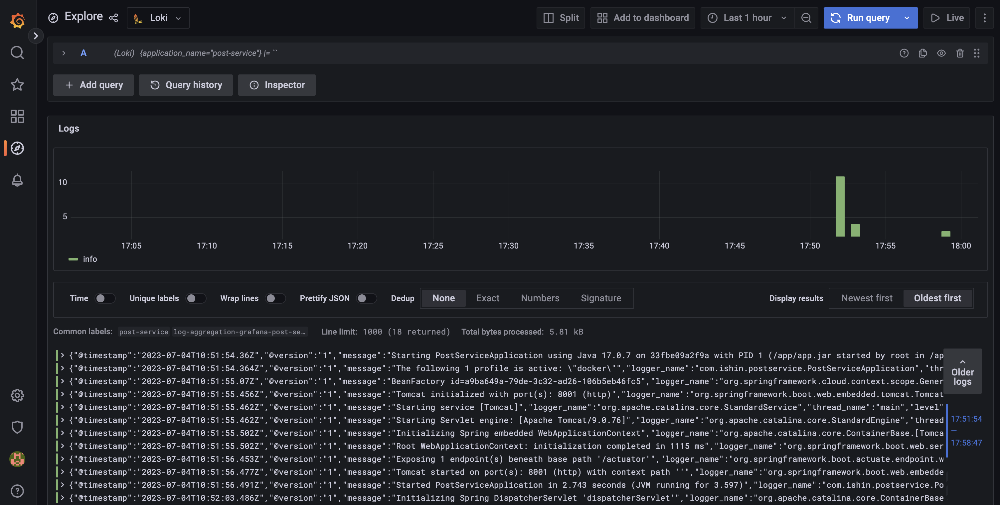

# log-aggregation-grafana
Example of Spring Boot 2.x with Grafana


The purpose of this project to experiment the log aggregation and distributed tracing with Grafana.


`Note:` This sample project is built to experiment with Spring-Boot 2.x.


<!-- GETTING STARTED -->
## Getting Started

### Prerequisites

- `Docker`
- `Docker Compose`

### Installation

1. Clone the repo
   ```sh
   git clone https://github.com/ishinvin/log-aggregation-grafana.git
   ```
2. Run the project
   ```sh
   cd log-aggregation-grafana && \
   docker-compose up -d
   ```

## Demo

1. Visit Grafana UI: [http://localhost:3000](http://localhost:3000/)


   

2. Invoke API for testing: [http://localhost:8001/posts/1](http://localhost:8001/posts/1)

3. Check Log data in `Loki`: [http://localhost:3000/explore](http://localhost:3000/explore)


   

4. Check Tracing in `Tempo`: [http://localhost:3000/explore](http://localhost:3000/explore)


   


<!-- CONTACT -->
## Contact

Ishin Vin - [@ishin_v](https://twitter.com/ishin_v)

Project Link: [https://github.com/ishinvin/log-aggregation-grafana](https://github.com/ishinvin/log-aggregation-grafana)